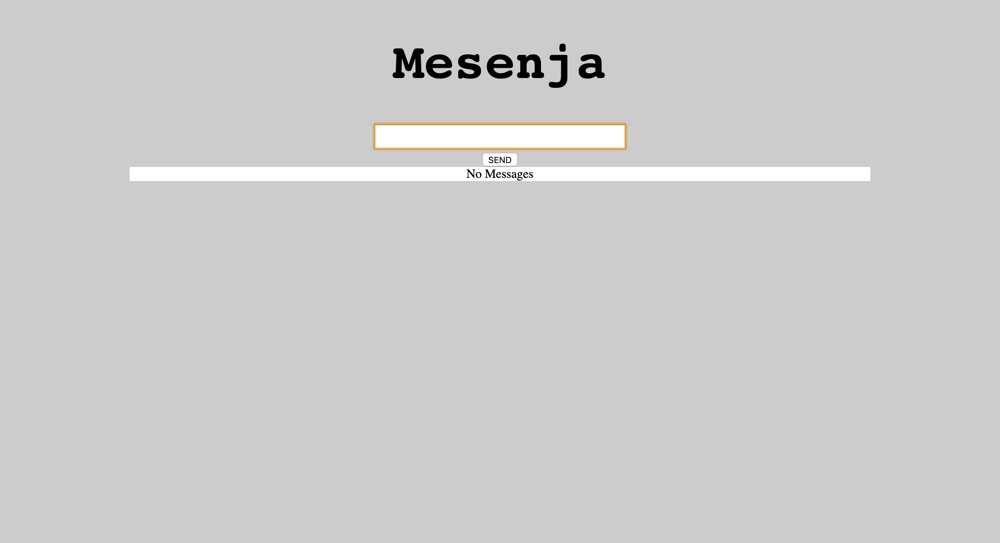
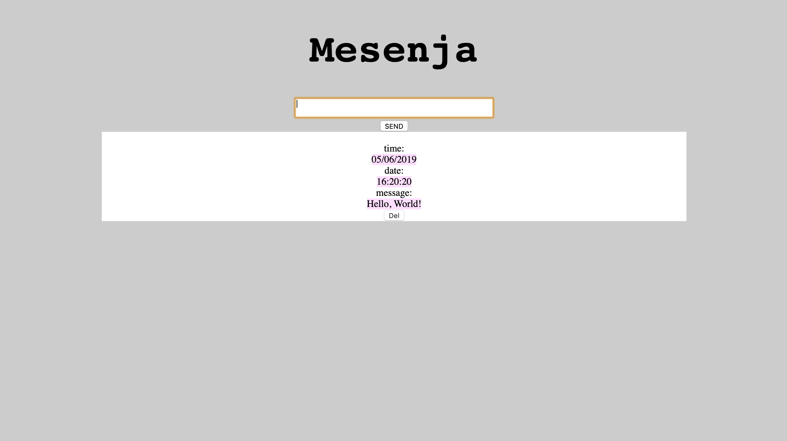

# Messenja-fullstack-app
Modelled off of [similar](https://github.com/tomlovesgithub/messenger_js) [projects](https://github.com/tomlovesgithub/Messenger) i've done in the past, this project was intended as a learning venture into react, and node libraries for fullstack development.
## To run
 - clone/download this repository
 - navigate to this repository in your terminal
 - run `npm i && cd messenja-backend-express npm i && cd messenja-client-react npm i`
 - then `npm start`
 - React should launch the webpage in your default browser for you

## About
Currently still WIP, the React frontend communicates with an express API which feeds a mongoose database.
I used mocha for the first time to test drive the backend for *get*,  *post*, *delete*, and  *update* features. I also used Cypress to configure, and refactor the frontend correctly.

## Current Features

 - Post a message, and have it saved to the database with content, time and unique ID
 
 - Delete individual messsages

   - in progress
     - view individual message
     - Update messages 
     - User Auth
     - Further styling

## Frontend
 - [**React**](https://reactjs.org/)
 - [**Axios**](https://www.npmjs.com/package/axios)
 - [**Cypress**](https://www.cypress.io/)

## Backend
 - [**Node.js**](https://www.npmjs.com/package/npm)
 - [**Express.js**](https://expressjs.com/)
 - [**Mongo.db**](https://www.npmjs.com/package/mongoose)
 - [**Supertest**](https://www.npmjs.com/package/supertest)
 - [**Mocha**](https://www.npmjs.com/package/mocha)
## Fullstack
 - [**Concurrently**](https://www.npmjs.com/package/concurrently)

#### Acknowledgements and resources
 - ['A TDD Approach to Building a Todo API Using Node.js and MongoDB' by Raja Sekar](https://semaphoreci.com/community/tutorials/a-tdd-approach-to-building-a-todo-api-using-node-js-and-mongodb)
 - ['API testing using SuperTest' by Chamara Madhushan Liyanage](https://hackernoon.com/api-testing-using-supertest-1f830ce838f1)
 - ['Let’s build a full stack MongoDB, React, Node and Express (MERN) app' by Jelo Rivera](https://medium.com/javascript-in-plain-english/full-stack-mongodb-react-node-js-express-js-in-one-simple-app-6cc8ed6de274)
 - ['Modern Front-End Testing with Cypress' by Michael Herman](https://www.cypress.io/blog/2019/02/05/modern-frontend-testing-with-cypress/#)
- ['Create a Todo app in react' By Krissanawat Kaewsanmuang](https://medium.com/front-end-weekly/create-a-simple-todo-app-in-react-72d9341a7e6c)
- ['Todo React App with Express backend' by Hui-An Yang](https://github.com/anhuiyang/todolist_app)
